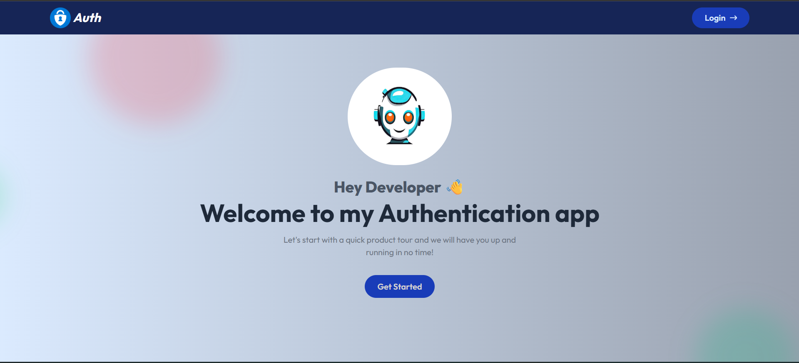
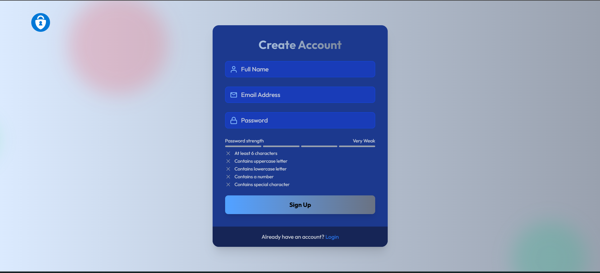
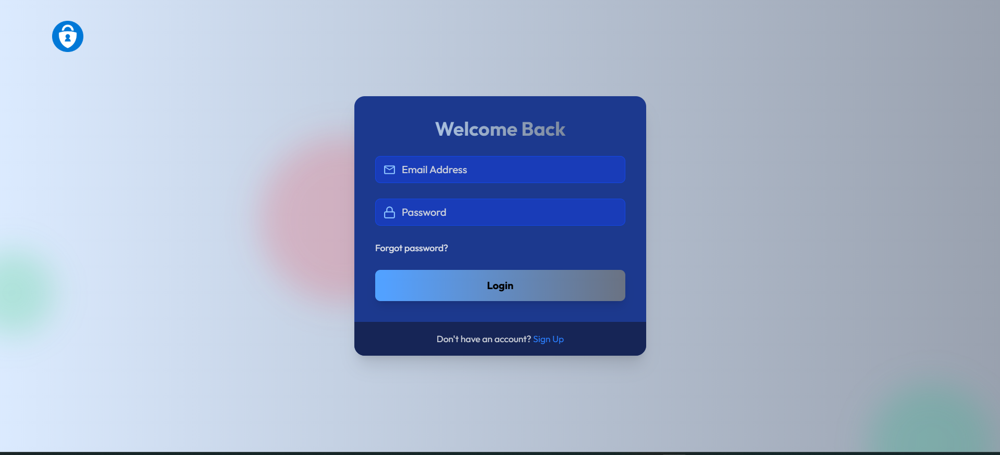
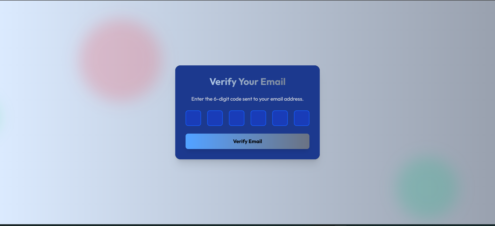
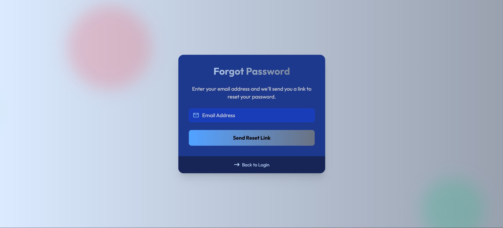
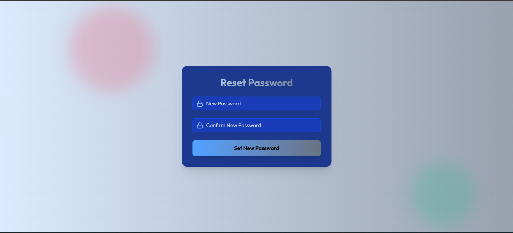
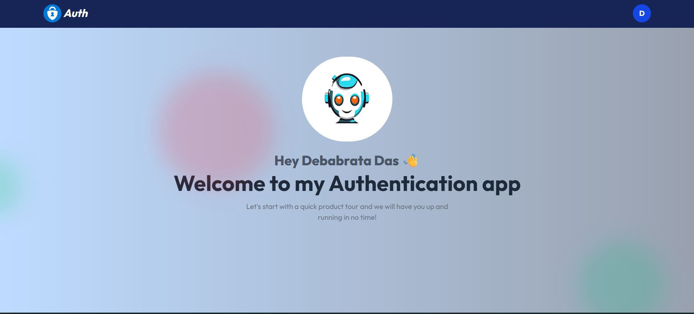
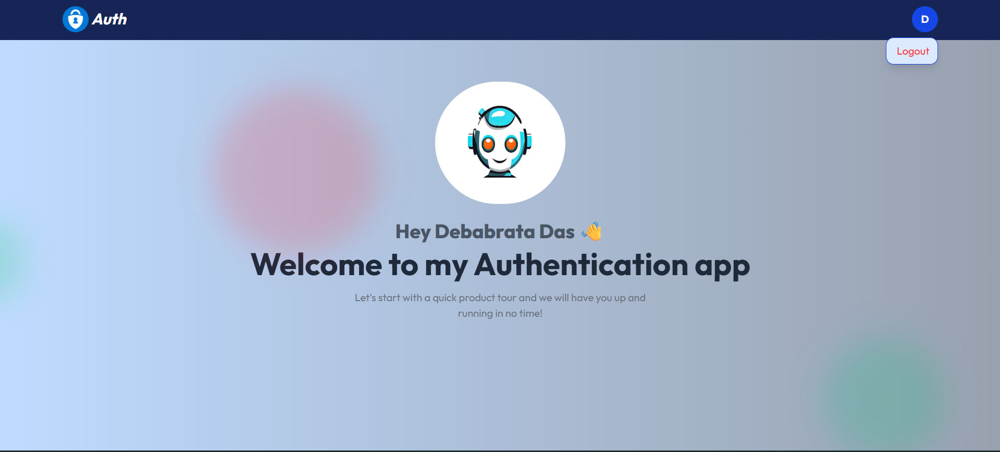

# 🔐 MERN Stack Authentication App

A full-stack Authentication System built with the MERN Stack (MongoDB, Express, React, Node.js) featuring secure login, email verification using OTP, and forgot password with OTP reset.

---

## 📸 Screenshots

### Dashboard Page



### SignUp Page



### Login Page



### Email Verify Page



### Forget Password Page



### Reset Password Page



### Home Page



### Logout Page



---

## 🚀 Features

- User Registration (Signup)
- User Login (Signin)
- JWT Authentication & Authorization
- Email Verification using OTP
- Forgot Password with OTP
- Reset Password functionality
- Password Hashing with bcrypt
- Protected Routes
- Logout Functionality
- MongoDB Database
- RESTful APIs
- Responsive UI

---

## 🛠️ Tech Stack

### Frontend:

- React.js
- Tailwind CSS / CSS
- Axios

### Backend:

- Node.js
- Express.js
- MongoDB
- Mongoose
- JWT (JSON Web Token)
- bcryptjs
- Nodemailer (for sending OTP emails)

---

## Project Structure

```bash
mern-auth-app/
│
├── client/
│   ├── src/
│   └── public/
│
├── server/
│   ├── models/
│   ├── routes/
│   ├── controllers/
│   ├── middleware/
│   ├── utils/
│   └── server.js
│
├── .env
├── package.json
└── README.md

```

---

## Authentication Flow

- Signup Flow:
- User registers with email & password
- OTP sent to email
- User verifies OTP
- Account activated
- Forgot Password Flow:
- User enters registered email
- OTP sent to email
- User verifies OTP
- User sets new password

---

## Run the Application

```bash
Start Backend

cd server
npm install
npm run dev

Start Frontend

cd client
npm install
npm start

```

## Author

**Debabrata Das**  
🎓 B.Tech in Computer Science Engineering  
💻 MERN Stack Developer
